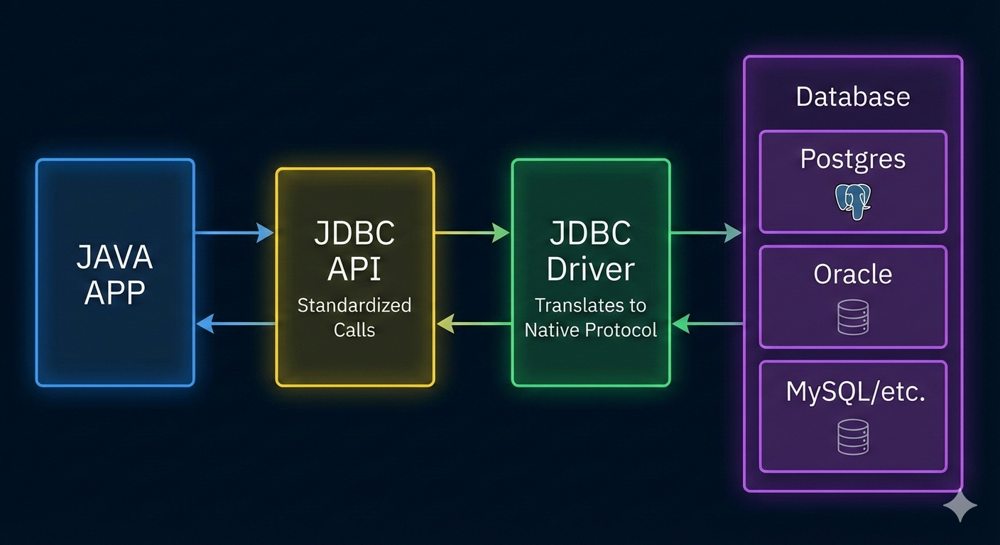

# Day 2: JDBC – Demystifying Connectivity

## 1. The JDBC Architecture

JDBC (Java Database Connectivity) is a standard API that abstracts the database vendor details from the Java code.

### 🏗 How it Works

1. **JDBC API:** The standard interfaces (`Connection`, `Statement`, `ResultSet`) provided by the JDK in `java.sql`.
2. **DriverManager:** The factory that manages the list of database drivers.
3. **JDBC Driver:** The vendor-specific implementation (e.g., `postgresql-42.x.jar` or `mysql-connector-j.jar`) that translates Java calls into network protocols the database understands.

### JDBC Driver Types

There are four distinct types of JDBC drivers, ranging from "bridging" older technology to "pure Java" solutions.

---

#### 1. Type 1: JDBC-ODBC Bridge Driver

This was the "ancestor" of JDBC drivers. It uses an ODBC (Open Database Connectivity) driver to connect to the database.

* **How it works:** The JDBC calls are converted into ODBC calls, which then talk to the database.
* **Pros:** Useful when no native JDBC driver existed for a specific database.
* **Cons:** Very slow (double translation). It requires ODBC to be installed on every client machine.
* **Status:** **Deprecated.** It was removed in Java 8 and is no longer used in modern development.

---

#### 2. Type 2: Native-API Driver (Partial Java Driver)

This driver uses client-side libraries (usually written in C or C++) provided by the database vendor.

* **How it works:** JDBC calls are converted into native calls of the database API (like Oracle OCI or MySQL C API).
* **Pros:** Faster than Type 1 because it removes the ODBC layer.
* **Cons:** Not portable. You must install the database's native client software on every machine running the Java app. If you move from Windows to Linux, you need a different native library.

---

#### 3. Type 3: Network Protocol Driver (All Java Driver)

This is a middleware-based approach. The driver talks to a "Middle Tier" server.

* **How it works:** The Java client sends requests to a middleware server using a generic network protocol. The middleware then converts these requests into the database's specific format.
* **Pros:** Very flexible. The client doesn't need to know which database is being used; only the middleware handles the complexity.
* **Cons:** Requires a separate middleware server to be maintained, which adds network latency.

---

#### 4. Type 4: Thin Driver (Native-Protocol All-Java Driver)

This is the **industry standard** and what you are using in your PostgreSQL training.

* **How it works:** It is written entirely in Java. It converts JDBC calls directly into the network protocol used by the database (e.g., the PostgreSQL wire protocol).
* **Pros:** * **High Performance:** Direct communication with the DB.
* **Portable:** Since it's pure Java, you just include a `.jar` file in your project. It works on any OS without installing native client software.

* **Cons:** Every database needs its own specific Type 4 driver (e.g., `postgresql-42.x.jar`).

---

#### Summary Comparison Table

| Feature          | Type 1 (Bridge) | Type 2 (Native)      | Type 3 (Middleware) | Type 4 (Thin)       |
|------------------|-----------------|----------------------|---------------------|---------------------|
| **Language**     | Native/C        | Partial Java         | Pure Java           | **Pure Java**       |
| **Installation** | ODBC required   | Client libs required | Middleware required | **None (Just JAR)** |
| **Performance**  | Lowest          | High                 | Medium              | **Highest**         |
| **Portability**  | No              | No                   | Yes                 | **Yes**             |
| **Usage**        | Obsolete        | Legacy Apps          | Rare/Complex        | **Modern Standard** |

---

